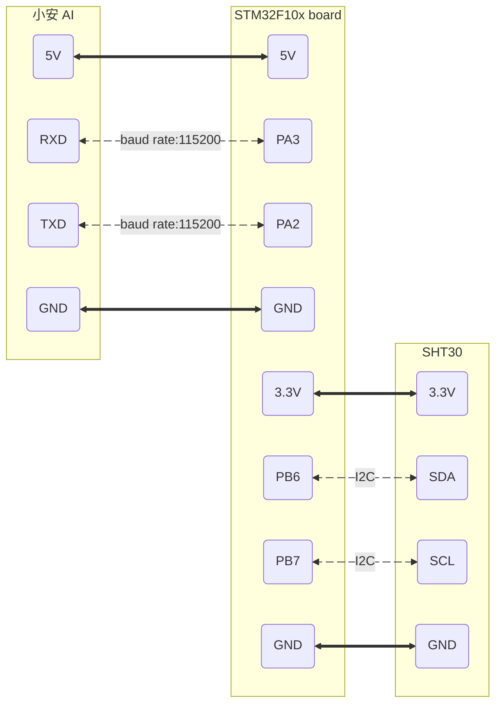

<h1 align="center">Wiring Instructions </h1>

```mermaid
flowchart LR
 subgraph xiaoAnAi["小安 AI"]
        A1("5V")
        B1("RXD")
        C1("TXD")
        D1("GND")
  end

 subgraph stm32["STM32F10x board"]
        A2("5V")
        B2("PA3")
        C2("PA2")
        D2("GND")
        3V3("3.3V")
        E1("PB6")
        F1("PB7")
        GND("GND")
  end
   subgraph SHT3X["SHT30"]
        SHT3X_3V3("3.3V")
        E2("SDA")
        F2("SCL")
        GND2("GND")
  end
    A1 <==> A2
    B1 e1@<--> |baud rate:115200|B2
    C1 e2@<--> |baud rate:115200|C2
    D1 <==> D2
    3V3 <==>SHT3X_3V3
    E1 e3@<--> |I2C|E2
    F1 e4@<--> |I2C|F2
    GND <==> GND2
e1@{ animation: fast }
e2@{ animation: fast }
e3@{ animation: fast }
e4@{ animation: fast }
```