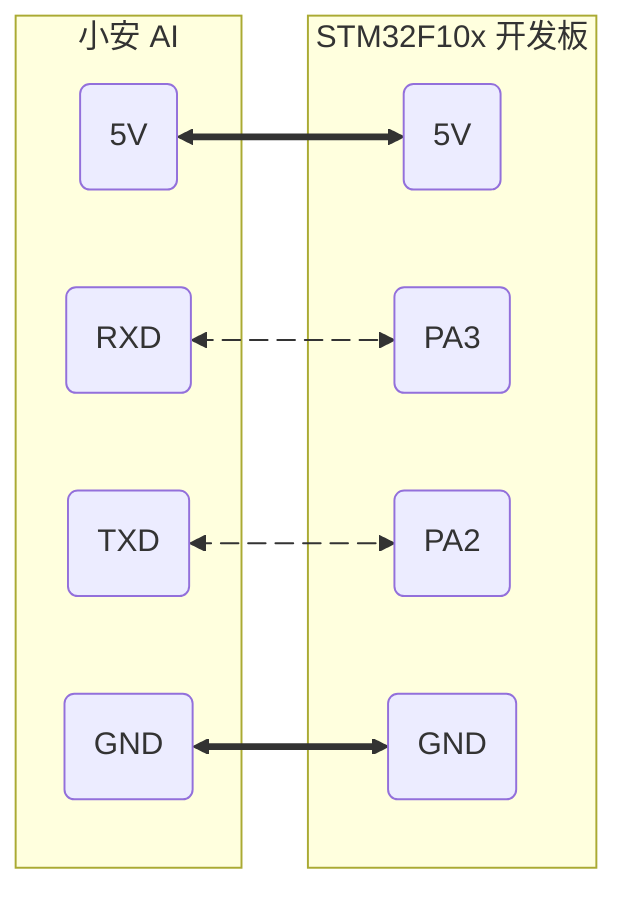

<h1 align="center">接线说明</h1>

```mermaid
flowchart LR
 subgraph xiaoAnAi["小安 AI"]
        A1("5V")
        B1("RXD")
        C1("TXD")
        D1("GND")
  end

 subgraph stm32["STM32F10x 开发板"]
        A2("5V")
        B2("PA3")
        C2("PA2")
        D2("GND")
  end
    A1 <==> A2
    B1 e1@<--> B2
    C1 e2@<--> C2
    D1 <==> D2

e1@{ animation: fast }
e2@{ animation: fast }
```